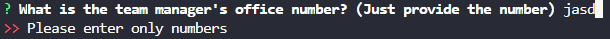
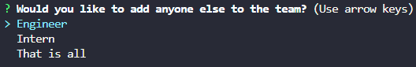
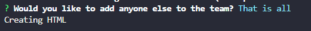
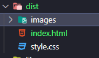

# Team-Profile-Generator

## Description
This is a command line application that allows a user to create an html file that contains information for a development team. It consist of a team manager and then any number of engineers and / or interns with a name, employee id, and email. Then some different information for each of the three depending on role.
## Installation
In order to use the application once you install the files from github onto your local machine, you will need to run npm i on the command line to download the inquirer library which is used for the questions. It will also install jest which is the library we used for unit testing.
## Usage
To start the program run 'node index.js' in the command line targeted at the root file of the repo. This will start the question prompts. The prompts require some form of input or you will receive a message asking you to provide something.

Once you are finished with the team manager questions you will be given a choice to select to add an additional team member and given the choice of: Engineer, Intern, or That is all

Selecting Engineer or Intern will generate more questions based on the information needed for them. Selecting 'That is all' will end the question prompt and generate the html file for you to view and use. 

It will be located in the dist folder.

## License
N/A

## Tests
There are some basic unit test in the 'tests' folder that make sure the class files are working as intended. In order to run them we use jest v24.9.0 which will be installed along with inquirer if you run npm i. To run the test simply input 'npm run test' in the command line while inside the repo file